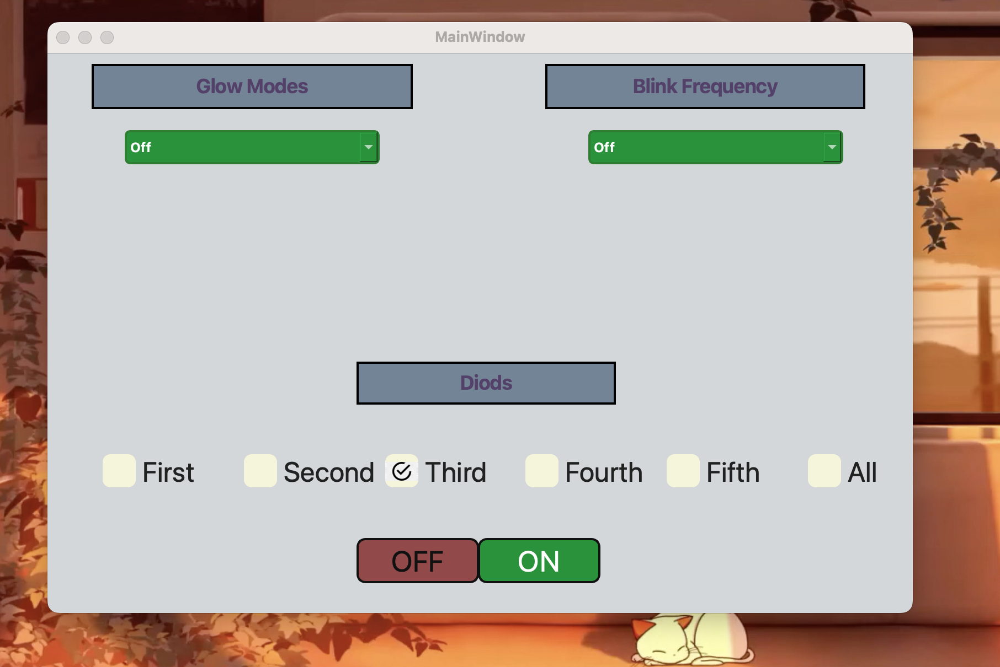

# Arduino Task

### The application has features:

1. Turn on All LEDs
2. Control All LEDs or individually each one
3. Different light modes
P.S. connect LEDs (3, 5, 6, 9, 10) - they support the PWM glow.

### Interface image

